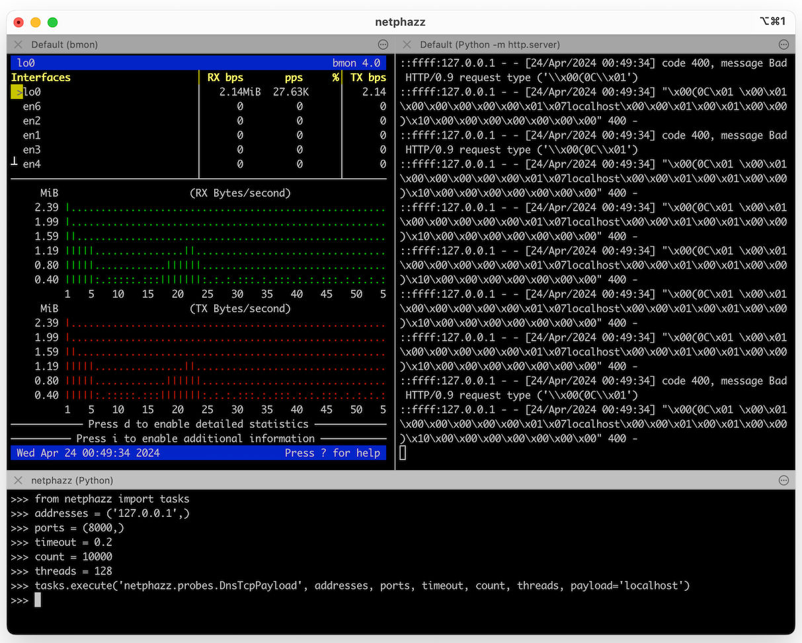

# netphazz

> Framework for vulnerability research and DDoS simulations

## Warning

**This tool can only be used for legitimate stress-testing, DDoS attack simulations, or vulnerability research, or for any other purpose you find it useful for, as long as you have consent.**

## Setting up

    (tty-1) # apt install redis-server; exit
    (tty-1) $ redis-server
    (tty-2) $ git clone https://github.com/tasooshi/netphazz
    (tty-2) $ cd netphazz; mkdir -p ./var/{run,log}/celery
    (tty-2) ~/netphazz$ python3 -m venv .venv
    (tty-2) ~/netphazz$ source .venv/bin/activate
    (tty-2) ~/netphazz$ pip install -r requirements.txt
    (tty-2) ~/netphazz$ cp netphazz/config.py.example netphazz/config.py

### Foreground worker

    (tty-3) ~/netphazz$ source .venv/bin/activate
    (tty-3) ~/netphazz$ celery -A netphazz worker --loglevel=DEBUG

### Daemonized workers on a single machine

    (tty-3) ~/netphazz$ source .venv/bin/activate
    (tty-3) ~/netphazz$ celery multi start 4 -A netphazz -l INFO --pidfile=./var/run/celery/%n.pid --logfile=./var/log/celery/%n%I.log

### For a truly distributed setup

...you need to figure it out yourself depending on the resources you have. In a cloud-based setup you could use VPC.

## Playbook

### Testing

If you want to make sure things work properly, the quickest way is to start a local HTTP server:

    ~/some/path/not-exposed$ python3 -m http.server

And then using the following snippet:

    (tty-2) ~/netphazz$ source .venv/bin/activate
    (tty-2) ~/netphazz$ python
    >>> from netphazz import tasks
    >>> addresses = ('127.0.0.1',)
    >>> ports = (8000,)
    >>> timeout = 1
    >>> count = 10
    >>> threads = 1
    >>> tasks.execute('netphazz.probes.DnsTcpPayload', addresses, ports, timeout, count, threads, payload='localhost')

The result should look like this:

### More examples

    (tty-2) ~/netphazz$ source .venv/bin/activate
    (tty-2) ~/netphazz$ python
    >>> addresses = ('127.0.0.1',)
    >>> ports = (53,)
    >>> timeout = 0.2
    >>> count = 10000
    >>> threads = 128
    >>> args = (addresses, ports, timeout, count, threads)
    >>> kwargs = {
    >>>     'payload': 'localhost',
    >>>     'min_length': 2,
    >>>     'max_length': 8,
    >>> }
    >>> tasks.execute('netphazz.probes.DnsUdpPayload', *args, **kwargs)
    >>> tasks.execute('netphazz.probes.DnsTcpPayload', *args, **kwargs)
    >>> tasks.execute('netphazz.probes.DnsUdpSubdomain', *args, **kwargs)
    >>> tasks.execute('netphazz.probes.DnsTcpSubdomain', *args, **kwargs)
    >>> tasks.execute('netphazz.probes.UdpRandom', *args, **kwargs)
    >>> tasks.execute('netphazz.probes.TcpRandom', *args, **kwargs)

In case you want to test a single IP using multiple workers, you can simply multiply the address list by the number of workers:

    >>> addresses = ('127.0.0.1',) * no_of_workers
